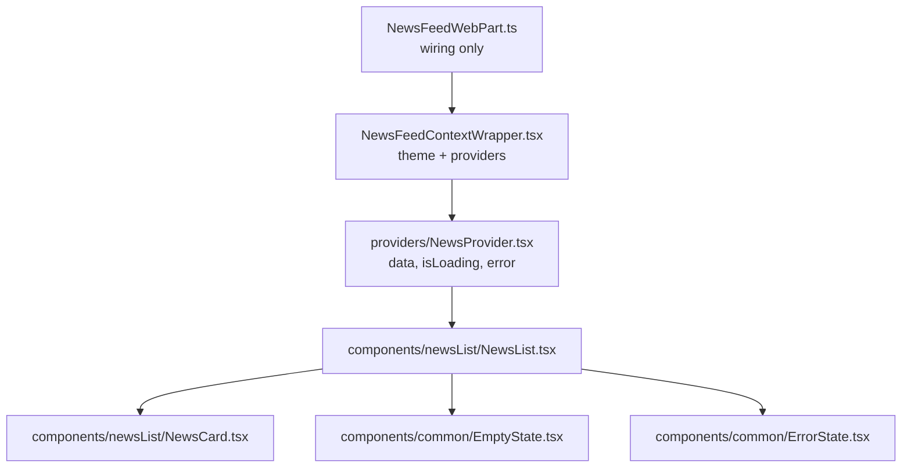
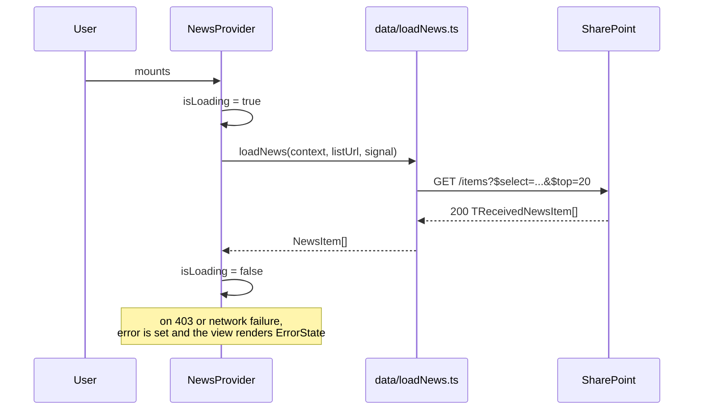

# spfx-architecture

Stage 1, the planning half. `spfx-specs` says **what** we are building and for whom. This says **how it will be put together** - and it is the last chance to notice that the plan does not work while changing it is still free.

Write it even for a small web part. It is one page, and it is the document the next session reads to remember the shape of the solution.

## Prerequisite

Read `docs/specs.md`. If it does not exist, run `spfx-specs` first - there is nothing to plan yet.

## Output

Write `docs/architecture.md`, in this order. On a solution with several web parts, one file per web part under `docs/architecture/<webpart>.md`, plus a short `docs/architecture/README.md` naming them.

### 1. What we are building

One paragraph, in plain language a non-developer can check. Who uses it, on what page, what they get. If this paragraph and `docs/specs.md` disagree, the specs win and the disagreement is a question for the user, not a thing to resolve quietly.

### 2. The component tree

A `flowchart TD`, following the layering in `spfx-structure`: web part class -> ContextWrapper -> providers -> components. Name real files, not concepts.



### 3. The data flow

A `sequenceDiagram` for the main interaction, from mount to rendered data, including the failure path. This is where a refetch storm or a missing abort becomes visible on paper.



### 4. Data sources

A table per source: list or library title, the internal field names used, the domain model it maps to, expected volume, and whether it exists yet. Then link to `docs/data-sources.md` for the full schema - do not duplicate it here.

An `erDiagram` earns its place only when two or more lists are related by a lookup. One list needs no diagram.

### 5. State ownership

A table: every piece of state, who owns it, and what re-renders when it changes.

| State | Owned by | Read by |
|---|---|---|
| `newsItems`, `isLoading`, `error` | `NewsProvider` | `NewsList` |
| `searchTerm` | `NewsList` | `NewsList` only |

Web part properties are not state - they arrive as props and every change remounts the tree. If any property drives a fetch, say so here and name `disableReactivePropertyChanges` as the mitigation.

### 6. The file plan

Every file to be created, with its path, following `spfx-structure`. This is the checklist stage 3 works through, and it is what makes "where does this go" a question already answered.

### 7. Risks and open questions

What could make this plan wrong: a permission nobody has approved, a list that does not exist, a volume that forces paging, an unknown. Named, not implied.

## Writing mermaid that actually renders

GitHub, VS Code and most viewers render ```mermaid fenced blocks, so these diagrams are readable without any tooling. A broken diagram is worse than no diagram, so:

- **Quote every label**: `A["Text here"]`. Unquoted labels break on `(`, `[`, `:`, `,` and `-`, which is most real file names and prose.
- `<br/>` for a line break inside a label. Nothing else works.
- Node ids are short and ASCII: `WP`, `CW`, `NP`. The label carries the name.
- Three diagram types cover everything here: `flowchart TD` for structure, `sequenceDiagram` for a flow over time, `erDiagram` for related lists.
- **Keep each diagram under about a dozen nodes.** Two clear diagrams beat one that has to be zoomed. If a diagram needs more, the design is too big for one web part.
- No colour, no `style` lines, no theming. These are read on a light and a dark background and colour adds nothing a label does not.

## Then

Summarise the plan back in a few sentences - the tree, the data flow, the risks - and ask the user to confirm it before anything is designed or built.

Then offer `spfx-data-sources` if any list or library does not exist yet, and `spfx-prototype` for stage 2. Do not start writing SPFx code.
